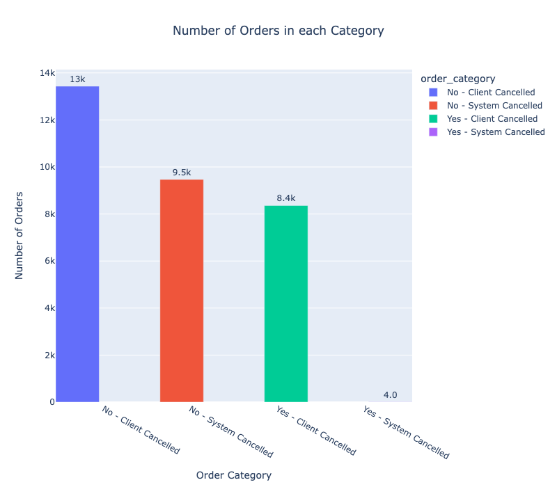
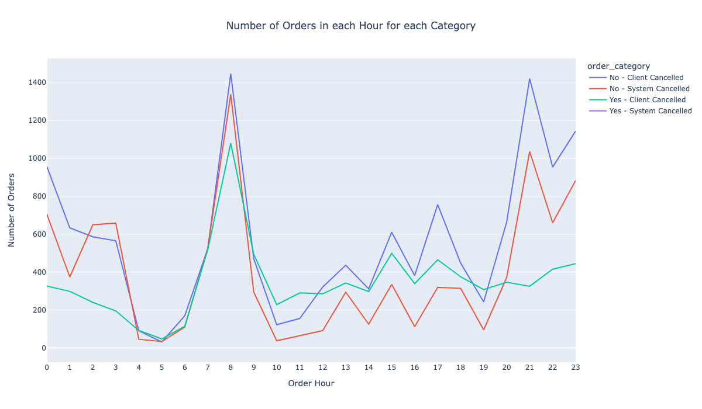
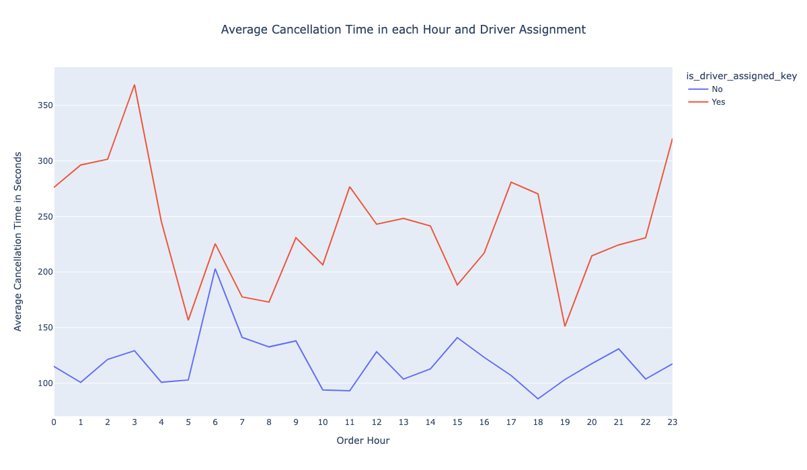
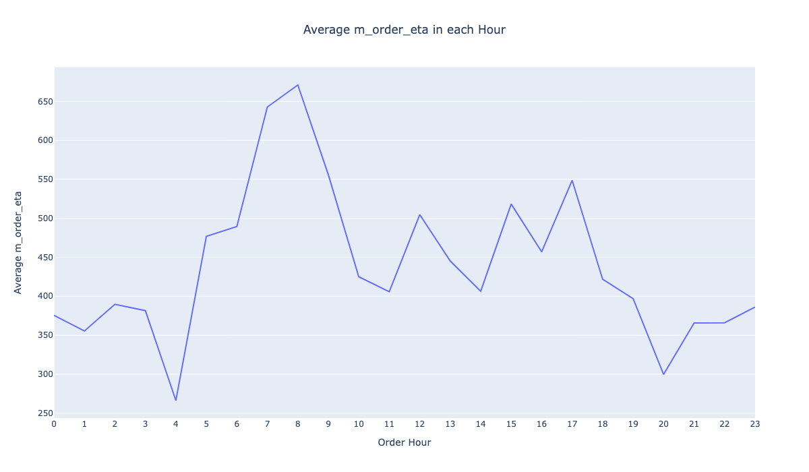

# Insights from Failed Orders

## Problem Statement
Gett, previously known as GetTaxi, is an Israeli-developed technology platform solely focused on corporate Ground Transportation Management (GTM). They have an application where clients can order taxis, and drivers can accept their rides (offers). At the moment, when the client clicks the Order button in the application, the matching system searches for the most relevant drivers and offers them the order. In this task, we would like to investigate some matching metrics for orders that did not completed successfully, i.e., the customer didn't end up getting a car.

## Data Description
We have two data sets: data_orders and data_offers, both being stored in a CSV format. The data_orders data set contains the following columns:

**order_datetime** - time of the order

**origin_longitude** - longitude of the order

**origin_latitude** - latitude of the order

**m_order_eta** - time before order arrival

**order_gk** - order number

**order_status_key** - status, an enumeration consisting of the following mapping:
- **4**- cancelled by client,
- **9**- cancelled by system, i.e., a reject

**is_driver_assigned_key** - whether a driver has been assigned

**cancellation_time_in_seconds** - how many seconds passed before cancellation

The **data_offers** data set is a simple map with 2 columns:

**order_gk** - order number, associated with the same column from the orders data set

**offer_id** - ID of an offer

## Data Insights Strategy

We will analyze dataset to explore the insights by looking into the following questions:

1. Build up distribution of orders according to reasons for failure: cancellations before and after driver assignment, and reasons for order rejection. Analyse the resulting plot. Which category has the highest number of orders?

2. Plot the distribution of failed orders by hours. Is there a trend that certain hours have an abnormally high proportion of one category or another? What hours are the biggest fails? How can this be explained?

3. Plot the average time to cancellation with and without driver, by the hour. If there are any outliers in the data, it would be better to remove them. Can we draw any conclusions from this plot?

4. Plot the distribution of average ETA by hours. How can this plot be explained?

## Insights and Analysis

**Question 1**

From the plot, we can see that the 'No Driver Assigned, Client Cancelled' category has the highest number of orders. This could suggest a couple of potential trends:
- Clients are canceling orders more often than the system does.
- When an order is placed, it's more likely that a driver isn't assigned when the client decides to cancel.

The 'Driver Assigned, System Cancelled' category, having only 4 orders, indeed indicates that once the system cancels an order, there's a very low probability that a driver would have been assigned. This could be because the system might be designed to cancel orders due to certain conditions (like a lack of available drivers) before a driver is assigned

**Question 2**

'System Cancelled, Driver Assigned': All orders in this category are cancelled at midnight. This could be due to various reasons, such as system maintenance activities or automatic cancellation of orders that remain unfulfilled at the end of the day.

All categories peak at 8 am: This might suggest that a significant number of orders are placed in the morning (perhaps for breakfast or morning commute), and consequently, there's also a higher number of cancellations during this time. This could be due to customers changing their plans, lack of available drivers, or longer wait times in the morning rush hour leading to cancellations.

Another peak at 9 pm for 'No Driver Assigned' cancellations: This might indicate a higher demand for services during this time, perhaps people returning home or going out for the night. If there's a shortage of available drivers during these peak hours, the system may cancel more orders due to unavailability of drivers.

'Client Cancelled, Driver Assigned' is significantly low during night hours: This could imply that customers tend not to cancel their orders once a driver has been assigned, especially during the night. This might be due to fewer alternatives available at night or possibly because customers are more certain about their plans during these hours.

**Question 3**

The plot suggests that there's a significant relationship between the assignment of a driver and the time taken to cancel an order. If an order has an assigned driver, it tends to be cancelled after a longer period than orders without a driver assigned. This makes sense, as customers may be more willing to wait if they know a driver is on the way.

We''ve also noted that there's a peak in cancellations at 3 A.M. This is interesting because it's an unusual time for peak activity, given that it's in the middle of the night when demand is usually lower. However, the higher cancellation rate might be due to a lack of available drivers at this hour. Customers who place an order might be more desperate for a ride at this time, but if they end up waiting too long, they may opt to cancel the order.

This analysis could offer valuable insights for improving the service. For example, a potential solution might be to incentivize more drivers to work during the early morning hours to meet this demand and reduce the wait times.

**Question 4**

Based on your observations, it seems that there is a strong correlation between the average waiting time and the number of failed orders. As the average waiting time (or ETA) increases, the number of failed orders (or cancellations) also increases.

This is a logical conclusion. Customers are likely to cancel their orders if the waiting time becomes too long, leading to a higher failure rate. This could be particularly true during peak hours, when demand is high and drivers may not be able to fulfill all orders promptly, leading to longer waiting times.

The increase in failed orders as the waiting time increases could be a sign of capacity issues. If the service is unable to meet demand, especially during peak hours, it may need to consider options such as recruiting more drivers, improving the efficiency of driver dispatch, or implementing a dynamic pricing model to balance supply and demand.
